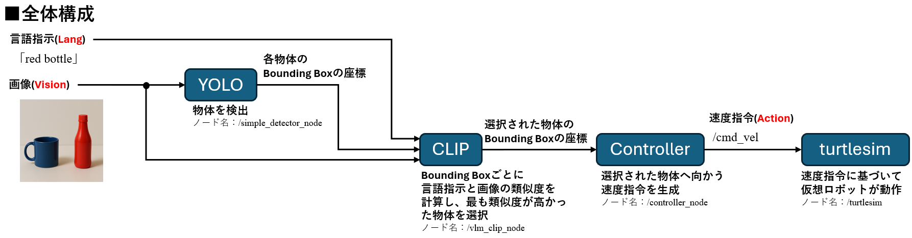
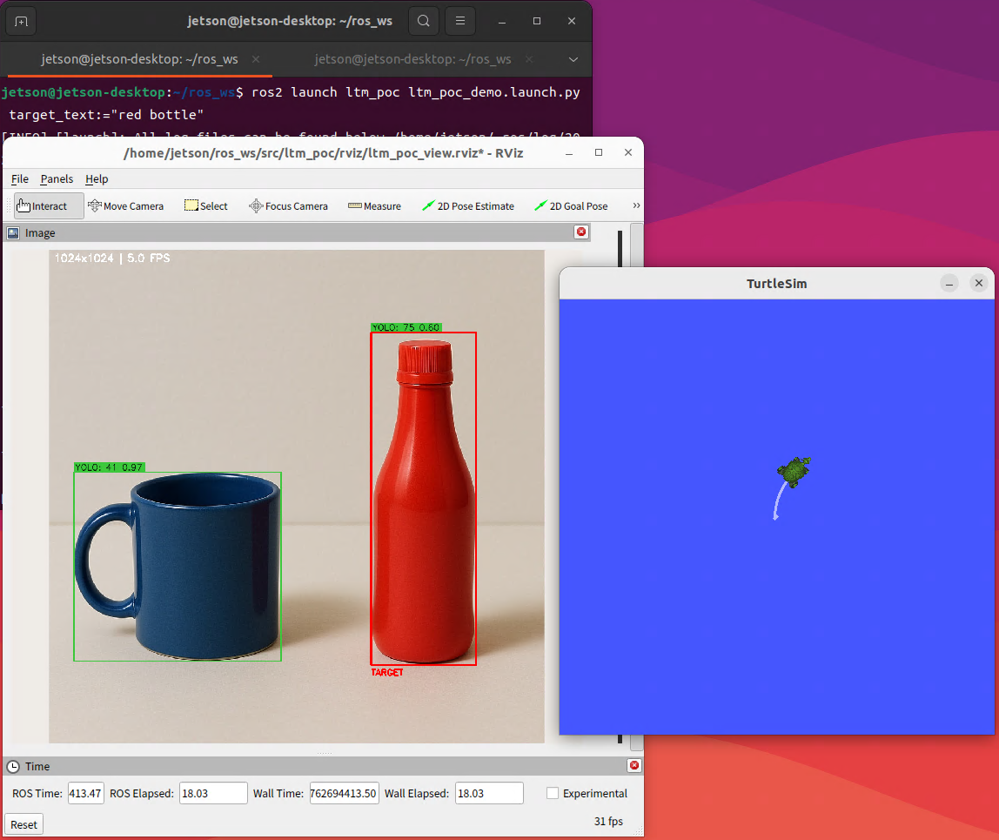

# 言語指示による動作生成PoC  
-Lang→Vision→Action パイプラインの実装-

---

## 概要

本PoCは、名詞句レベルの言語入力（例: "red bottle"）に基づき、AIモデル CLIP による視覚−言語マッチングで対象物体を選択し、ROS2上でロボット（turtlesim）がその対象物体の方向へ移動するシステムである。  

「言語 → 視覚 → 行動」という一連の流れをROS2ノード群によって再現している。  

---

## システム構成

<p align="center">
  
</p>

| Node | 役割 |
|:--|:--|
| /simple_detector_node | YOLOによる物体検出を実施し、各Bounding Box領域をCLIPへ送信する |
| /vlm_clip_node | 入力テキスト（例: "red bottle"）と各BBox画像との類似度を計算し、最も類似度が高かった物体を選択する |
| /controller_node | 選択された物体の座標に基づき /cmd_vel を生成する |
| /turtlesim | 仮想ロボット環境。/cmd_vel を受け取り、選択された物体の方向へ移動する |
| /viewer_node | OpenCVウィンドウ上でBounding Boxと選択された物体を可視化する |

---

## 課題と今後の展開

### 課題  
ロボットの移動結果が新たな視覚入力として反映されず、オープンループ構成に留まっている。  

### 今後の展開  
Gazebo環境と統合し、動作後の視覚情報を再入力することで、移動後の視覚情報を再入力するクローズドループ化を目指す。

---

## 実行環境

| 項目 | 内容 |
|:--|:--|
| ハードウェア | Jetson Orin Nano |
| OS | Ubuntu 22.04 LTS |
| ミドルウェア | ROS2 Humble|
| AIモデル | YOLOv8n（物体検出） / CLIP (ViT-B/32)（視覚−言語マッチング） |
| 言語 | Python 3.10 |
| 主要ライブラリ | ultralytics, open_clip_torch, opencv-python, numpy |
| 補足 | PyTorchはJetson環境に合わせて手動インストールが必要。 |

---

## 実行手順

### 1. リポジトリの取得
```bash
cd ~/ros_ws/src
git clone https://github.com/yuta-physical-ai/ltm_poc.git
```

### 2. ビルド
```bash
cd ~/ros_ws
colcon build
source install/setup.bash
```

### 3. 実行
```bash
ros2 launch ltm_poc ltm_poc_demo.launch.py target_text:="red bottle"
```

---

## デモ画像

<p align="center">
  
</p>

---

## キーワード

ROS2 / YOLO / CLIP / VLM / Jetson / PhysicalAI / LangVisionAction
